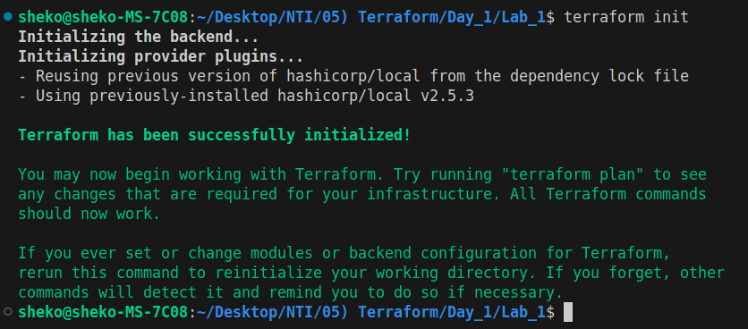
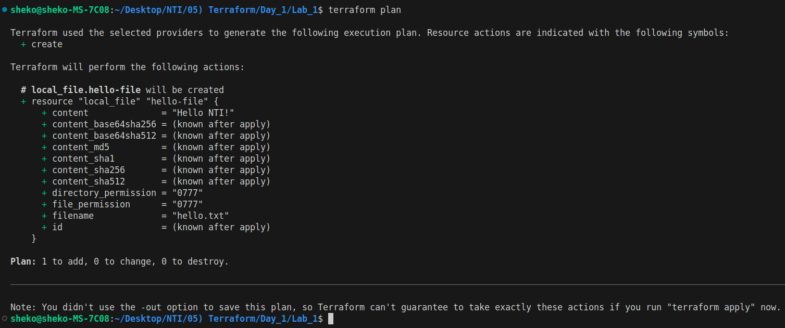
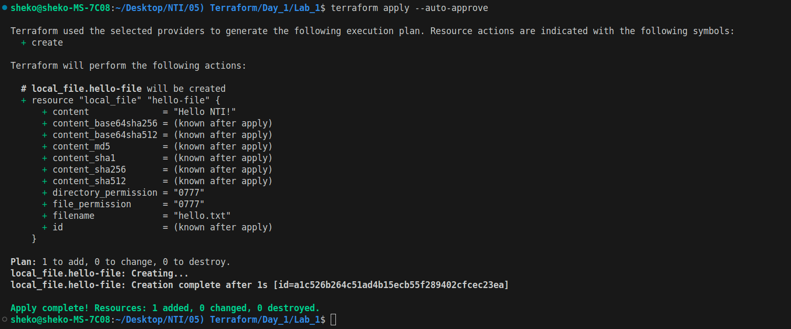
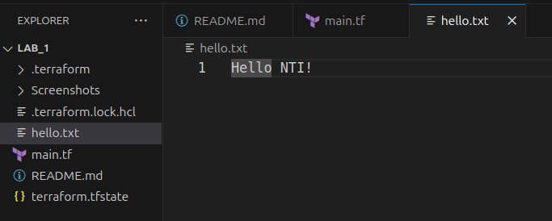
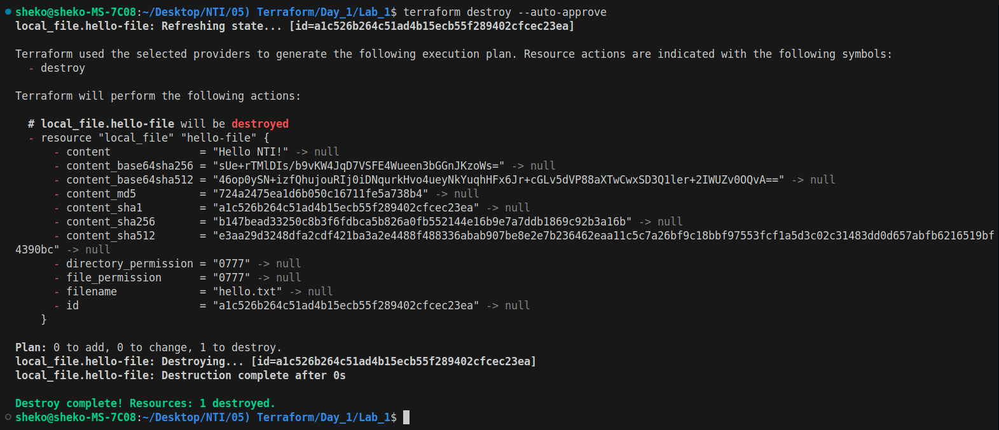

# Lab: Create a Local File with Terraform

## Objective: Use Terraform to create a file on your local machine.

### Task 1: Write a Terraform configuration file (main.tf) to:
- Use the `local` provider.
- Define a `local_file` resource with the following properties:
    - Content: `Hello NTI!`
    - Filename: `hello.txt`.

-> [main.tf](main.tf)
    
### Task 2: Initialize Terraform to install the local provider.

  

### Task 3: Run terraform plan to preview the file creation.

  

### Task 4: Apply the configuration to create the file.

  

### Task 5: Verify the file exists at hello.txt.

  

### Task 6 (Optional): Destroy the file using terraform destroy

  

---