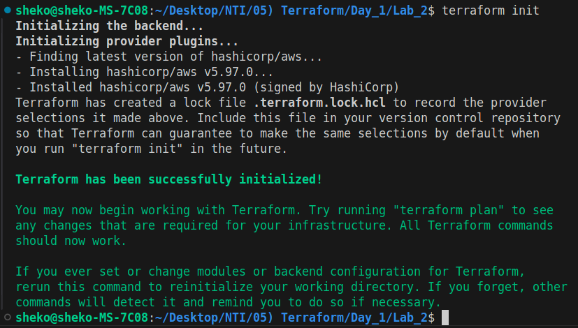
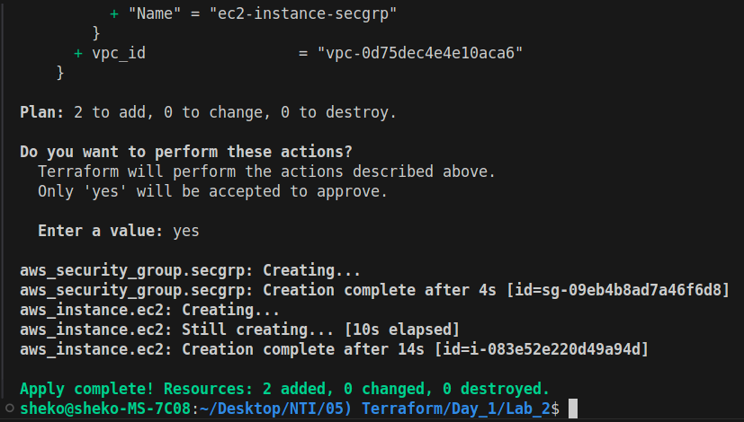
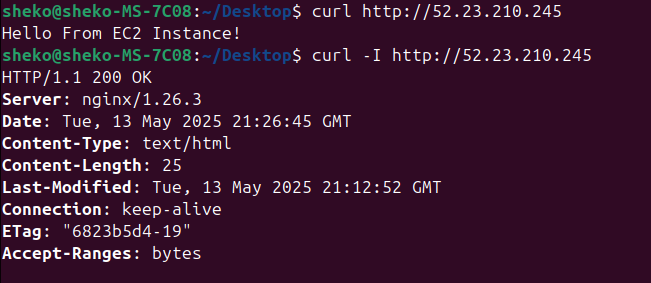
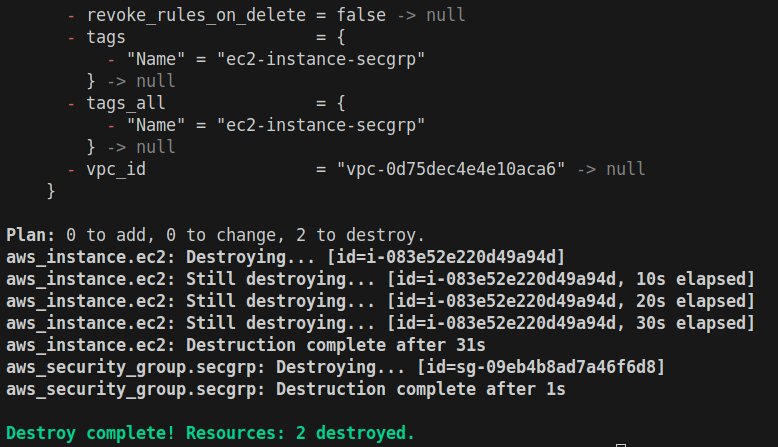

# Lab: Deploy an EC2 Instance with User Data

## Objective:
- Automate provisioning of an AWS EC2 instance.
- Use user data to install Nginx and host a simple webpage.

## Key Concepts:
- Terraform configuration (`main.tf`).
- Security groups (HTTP/SSH access).
- User data scripts.

### Task 1: Write a Terraform configuration (main.tf) to:
- Define an AWS EC2 instance.
- Allow HTTP (port 80) and SSH (port 22) access via a security group.
- Add a user data script to install Nginx and write a test HTML file.

### Task 2: Initialize Terraform and deploy the instance.

  <strong>Initializing Terraform Project</strong>
   
  

  <strong>Applying Resources</strong>
   
  

### Task 3: Verify the webpage is accessible.

  

### Task 4: Destroy the infrastructure.

  

### Key Notes:
- **Security Warning:** Avoid exposing SSH (port 22) to 0.0.0.0/0 in production!