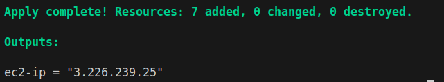
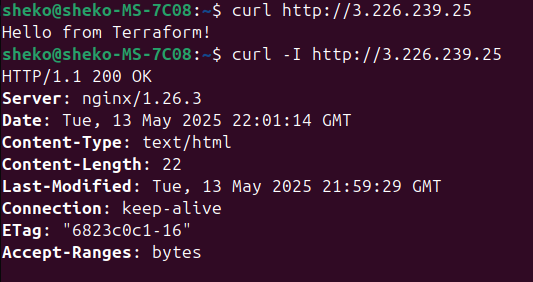
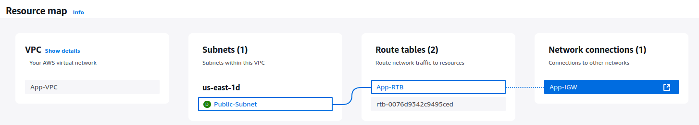
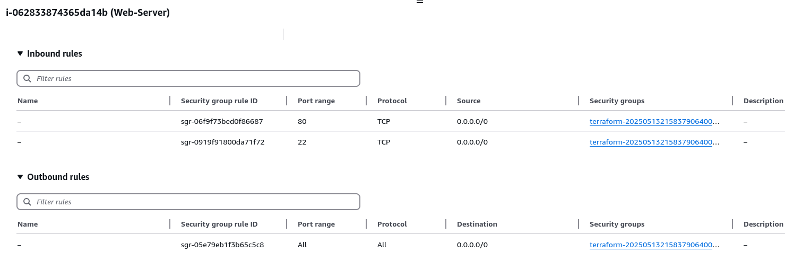
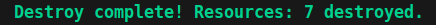

# Lab: Build a VPC, Public Subnet, and EC2 Instance

## Task 1: Create a VPC
### Objective: Define a VPC with CIDR block 10.0.0.0/16.
### Requirements:
- Enable DNS hostnames.
- Add a tag Name = `App-VPC`.

## Task 2: Create an Internet Gateway
### Objective: Attach an internet gateway to the VPC.
### Requirements:
- Add a tag Name = `App-IGW`.

## Task 3: Create a Public Subnet
### Objective: Define a subnet within the VPC.
### Requirements:
- CIDR block: `10.0.1.0/24`.
- Enable auto-assignment of public IPs (map_public_ip_on_launch = true).
- Add a tag Name = `Public-Subnet`.

## Task 4: Configure Routing
### Objective: Ensure the subnet has internet access.
### Requirements:
- Create a route table with a default route (`0.0.0.0/0`) to the internet gateway.
- Associate the public subnet with the route table.

## Task 5: Define a Security Group
### Objective: Allow HTTP (port 80) and SSH (port 22) traffic.
### Requirements:
- Inbound rules for HTTP (`80`) and SSH (`22`) from `0.0.0.0/0`.
- Allow all outbound traffic.
- Add a tag Name = `Web-SG`.

## Task 6: Launch an EC2 Instance
### Objective: Deploy an EC2 instance with Nginx installed.
### Requirements:
- Use AMI (`ami-0f88e80871fd81e91` in `us-east-1`).
- Instance type: `t2.micro`.
- Place the instance in the public subnet.
- Attach the security group.
- User Data Script:
    ```bash
    #!/bin/bash
    sudo dnf install -y nginx
    sudo systemctl start nginx
    sudo systemctl enable nginx
    echo "Hello from Terraform!" > /usr/share/nginx/html/index.html
    ```
- Add a tag Name = `Web-Server`.

## Task 7: Output the Public IP
### Objective: Display the EC2 instance’s public IP after deployment.

<p align="center">
  
</p>

## Task 8: Verify Deployment
1. Check the Web Server:
- Access `http://<PUBLIC_IP>` in a browser. You should see `Hello from Terraform!`.

<p align="center">
  
</p>

2. AWS Console Checks:
- Confirm the VPC, subnet, and instance exist.

<p align="center">
  
</p>

- Verify the security group rules.

<p align="center">
  
</p>

## Task 9: Clean Up
### Objective: Destroy all resources to avoid AWS charges.
### Command: terraform destroy

<p align="center">
  
</p>