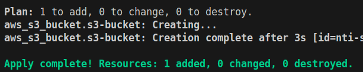

# Lab: Managing Terraform State

## Task 1: Initialize and Deploy Infrastructure
- Create a [main.tf](main.tf) file to create an S3 bucket (use nti-{yourname} as a Prefix)
- `terraform init`
- `terraform apply` # Type "yes"

  

## Task 2: Explore the State File
- `terraform state list` # Output: aws_s3_bucket.state_bucket

  

- `terraform state show aws_s3_bucket.state_bucket` # Displays bucket attributes

  

- `cat terraform.tfstate` (do not edit manually!)

## Task 3: Simulate State Drift
1. Manually Delete the Bucket:
- Delete the S3 bucket via the AWS Console.

  

2. Refresh State:
- `terraform refresh` # Updates state to reflect real-world infrastructure

  

3. Reapply:
- `terraform apply` # Recreate the bucket

## Task 4: Rename a Resource in State
1. Rename the Resource in Code:
- In `main.tf`, change the resource name for S3
2. Update State:
- `terraform state mv aws_s3_bucket.[oldresource_name] aws_s3_bucket.[newresource_name]`
3. Verify:
- `terraform state list`

  

## Task 5: Remove a Resource from State
1. Manually Delete the Bucket Again (via AWS Console).
2. Remove from State:
- `terraform state rm aws_s3_bucket.[resource_name]`
3. Observe:
- `terraform plan`

  

## Task 6: Migrate to Remote State
1. Create S3 Bucket from Console (use nti-{yourname}-state as a prefix)

  

2. Add an S3 Backend:
- Update `main.tf` to add a new backend
3. Reinitialize:
- `terraform init`
4. Verify:
- Check the S3 bucket for the `terraform.tfstate` file.

  

  <strong>After uploading the state file to the S3 bucket</strong>
   
  

## Clean Up
- `terraform destroy`
