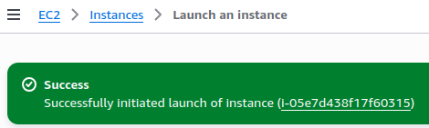
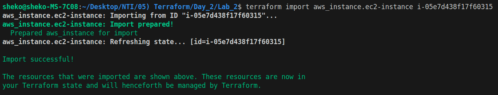
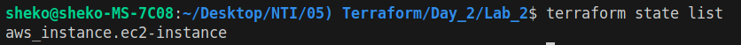
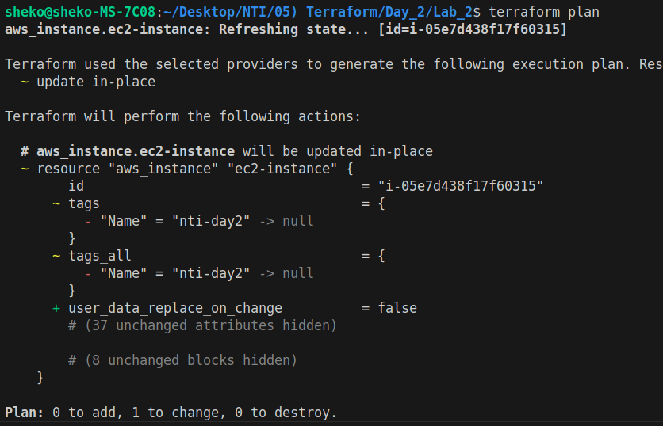
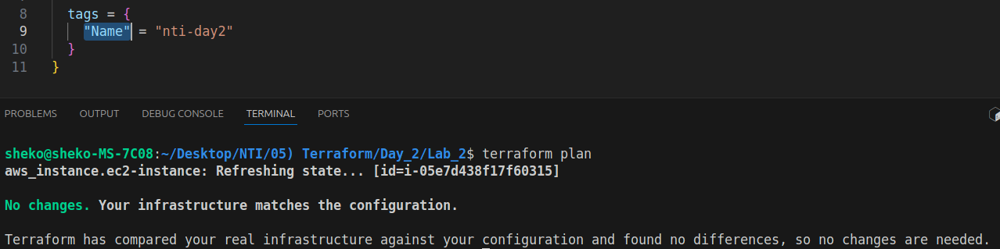
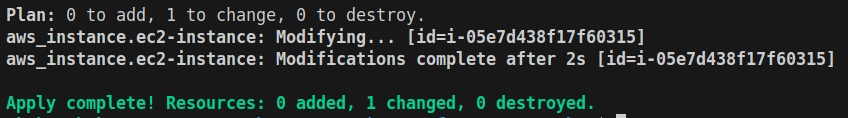
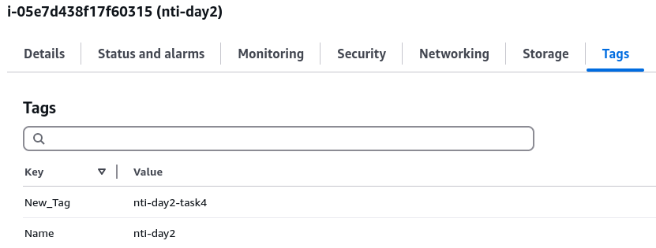

# Lab: Import Existing Infrastructure into Terraform

## Task 1: Set Up Your Environment
### Objective: Prepare an AWS resource and Terraform configuration.
1. Manually Create an EC2 Instance
- Go to AWS Console → EC2 → Launch Instance:
  - AMI: `ami-0953476d60561c955` (Amazon Linux 2023, us-east-1).
  - Instance Type: `t2.micro`.
  - Note the Instance ID (e.g., i-0abc123def456).

  

2. Initialize Terraform
- Create a `main.tf` file
- Run: `terraform init`

## Task 2: Import the EC2 Instance
### Objective: Link the manual EC2 instance to Terraform state.
1. Run the Import Command: `terraform import`

  

2. Verify the Import
- Check the state: `terraform state list`

  

## Task 3: Align Configuration with Imported Resource
### Objective: Update Terraform code to match the imported instance.
1. Inspect Imported Attributes: `terraform show`
**Note**:
- ami -> `ami-0953476d60561c955`
- instance_type -> `t2.micro`
- subnet_id -> `subnet-0eb073fc1b10df568`
- vpc_security_group_ids -> `["sg-002bd45524ee7ec36"]`
2. Update `main.tf`
3. Check for Drift

  

  

## Task 4: Modify and Manage the Instance
### Objective: Test Terraform’s control over the imported resource.
1. Add a Tag
2. Run: `terraform apply`

  

3. Verify in AWS Console
  - Check if the EC2 instance now has the Name tag.

  

## Cleanup
- `terraform destroy`